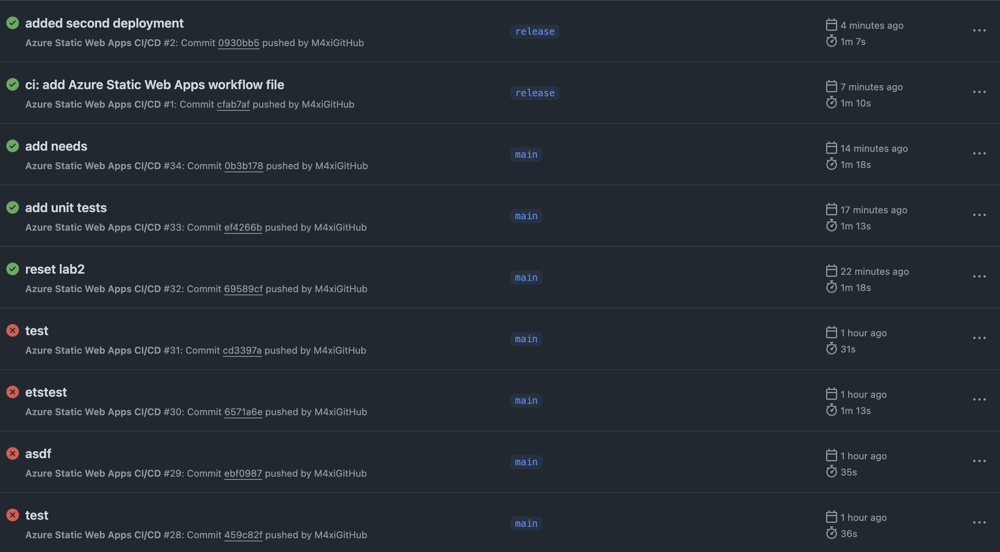
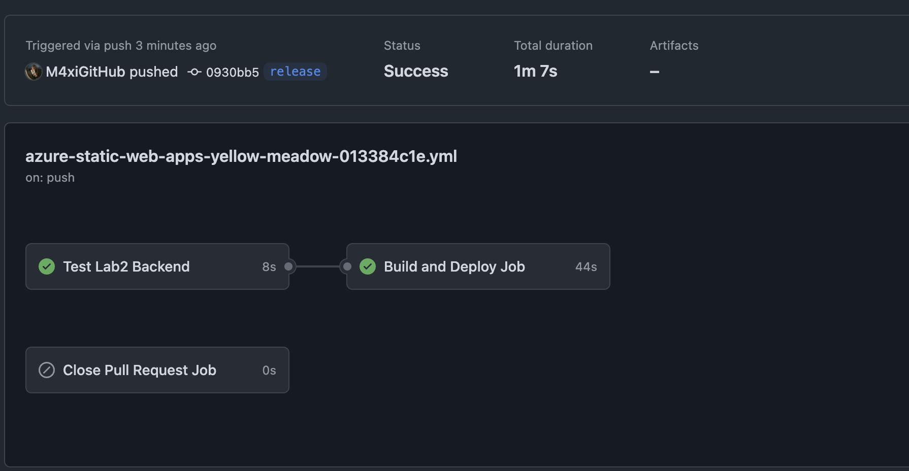

## Documentation:
Development (Dev):
* Der main-Branch enthält die neueste Version der Anwendung.
* Änderungen in diesem Branch werden automatisch in die Development-Umgebung (https://happy-rock-04c53d003.5.azurestaticapps.net/) bereitgestellt.
* Tests werden in der CI/CD-Pipeline ausgeführt, um sicherzustellen, dass der Code korrekt ist.

Production (Prod):
* Der release-Branch enthält den stabilen Code, der in der Production-Umgebung (https://yellow-meadow-013384c1e.4.azurestaticapps.net/) bereitgestellt wird.
* Änderungen aus dem main-Branch müssen in den release-Branch gemerged werden, um ein Release auszulösen.

# Screenshots:

## Succeeded and failed Pipelines

## Release Pipeline

