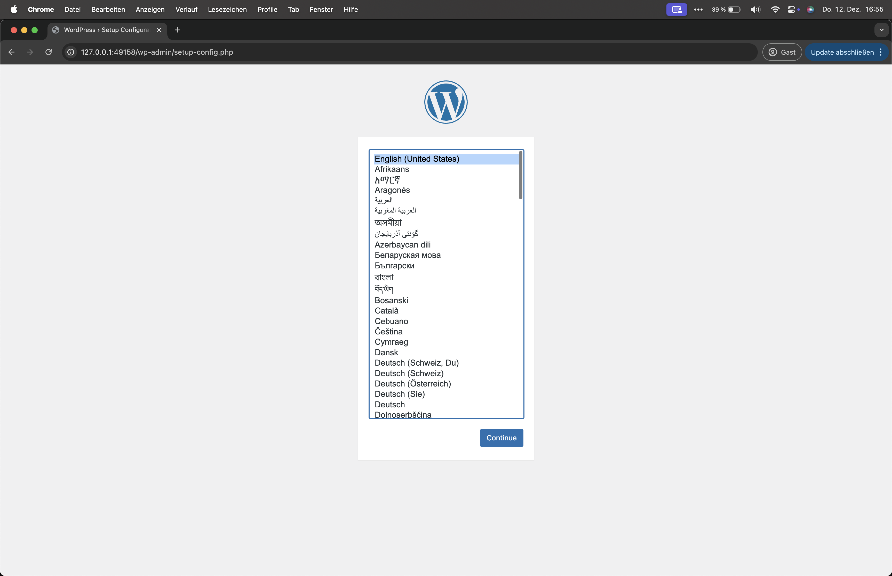
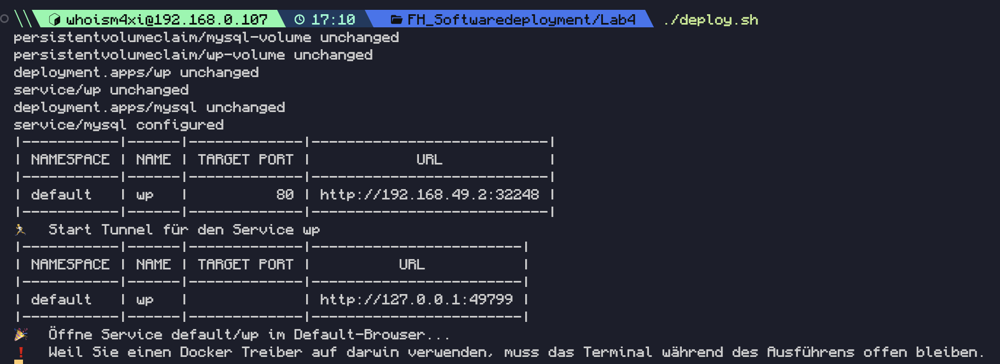

# Wordpress & MySQL on Minikube

1. Als ersters muss minikube gestartet werden.
```bash
minikube start --driver=docker --cpus=4   
```

2. Dem Deployment script rechte geben.
```bash
chmod +x deploy.sh
```

3. Deployment ausführen
```bash
./deploy.sh
```
## Wordpress im Browser

## Kubernetes 



## deploy.sh
Das file was sich für die das lokale deployment kümmert.
## services.yml
In diesem files sind die 2 services angegeben ```MySQL``` und ```Wordpress```
## volumes.yml
In diesem file sind die volumes delkariert für die speicherung der daten